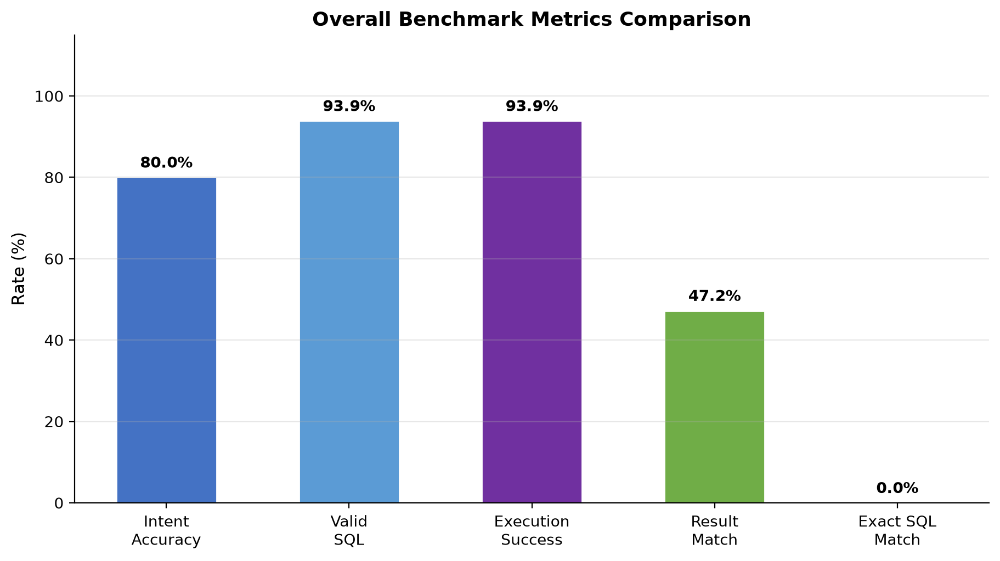
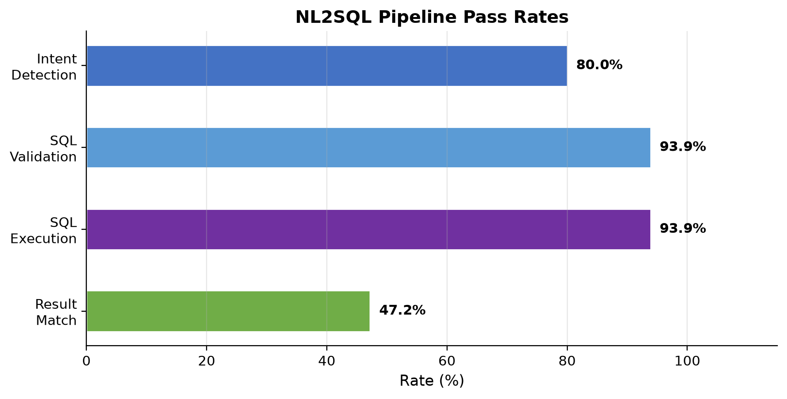
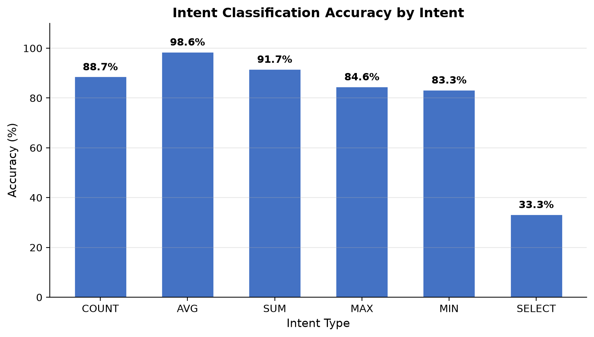
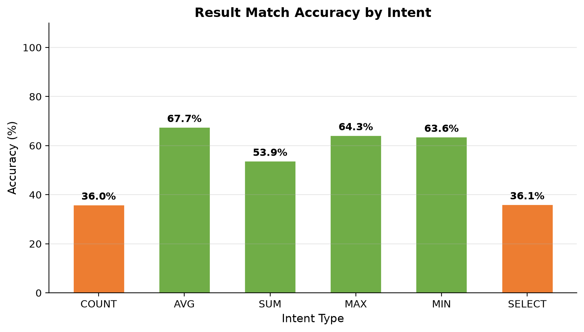
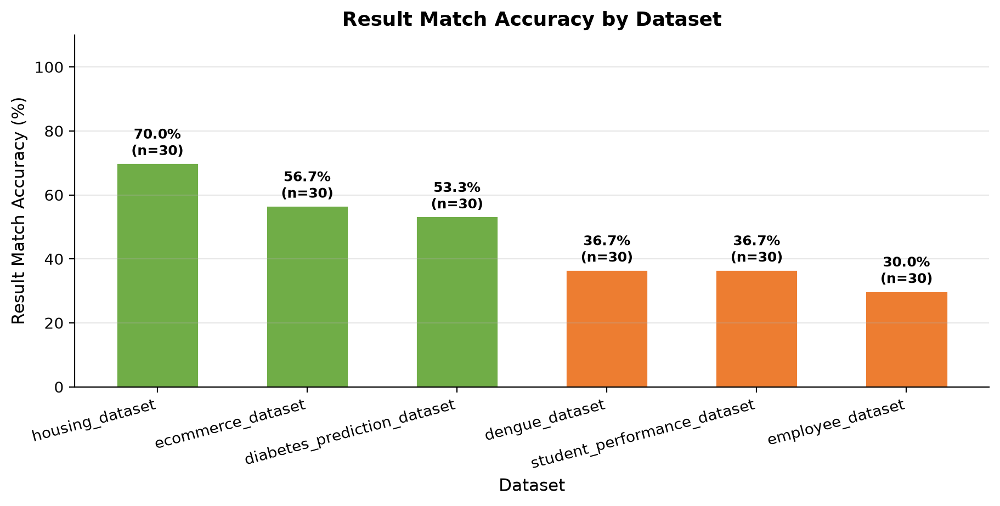
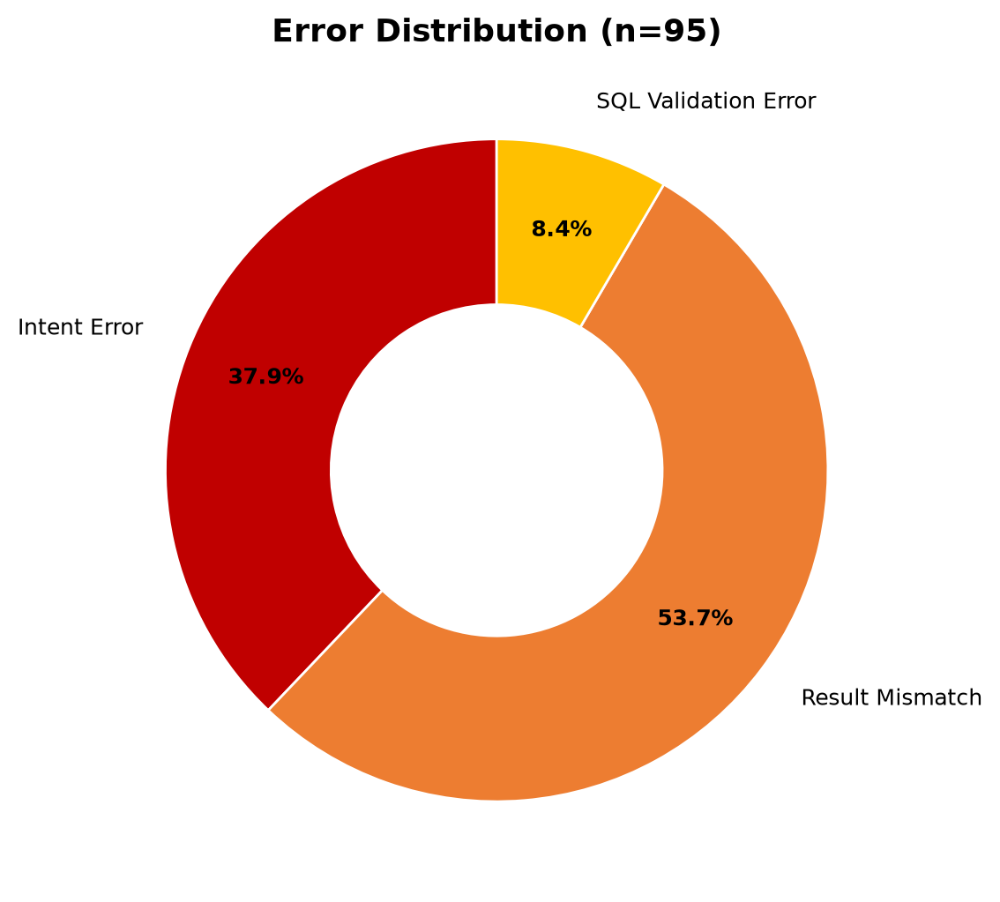

# NL2SQL-366 Benchmark Report

**Generated:** 2026-08-19 05:48 UTC
**Total Runtime:** 26.90 seconds

## 1. Benchmark Overview

- **Total SQL Queries Evaluated:** 180
- **Number of Datasets/Schemas:** 6
- **Datasets:** dengue_dataset, diabetes_prediction_dataset, ecommerce_dataset, employee_dataset, housing_dataset, student_performance_dataset
- **Queries per Dataset:** 30
- **Intent Distribution:**
  - AVG: 34 queries
  - COUNT: 25 queries
  - MAX: 14 queries
  - MIN: 11 queries
  - SELECT: 83 queries
  - SUM: 13 queries

## 2. Overall Results

| Metric | Score |
|--------|-------|
| Intent Accuracy | 80.00% |
| Valid SQL | 93.89% |
| Execution Success | 93.89% |
| Result Match Accuracy | 47.22% |
| Exact SQL Match | 0.00% |
| Macro F1 | 62.98% |
| Avg SQL Generation Time | 0.01 ms |
| Avg Execution Time | 7.22 ms |
| Total Passed | 85 |
| Total Failed | 95 |

### 2.1 Method Comparison

| Method | Description | Accuracy |
|--------|-------------|----------|
| Reference SQL | Ground-truth SQL executed directly | 100.00% |
| NL2SQL-366 | Natural language to SQL pipeline | 47.22% |

> Reference SQL is treated as ground truth. NL2SQL-366 is correct when generated SQL produces the same result as the reference SQL.

## 3. Per-Intent Results

| Intent | Queries | Intent Acc. | Result Match | Exact SQL | Valid SQL | Exec Success |
|--------|---------|-------------|--------------|-----------|-----------|-------------|
| AVG | 34 | 100.00% | 67.65% | 0.00% | 91.18% | 91.18% |
| COUNT | 25 | 80.00% | 36.00% | 0.00% | 88.00% | 88.00% |
| MAX | 14 | 100.00% | 64.29% | 0.00% | 92.86% | 92.86% |
| MIN | 11 | 100.00% | 63.64% | 0.00% | 90.91% | 90.91% |
| SELECT | 83 | 62.65% | 36.14% | 0.00% | 100.00% | 100.00% |
| SUM | 13 | 100.00% | 53.85% | 0.00% | 76.92% | 76.92% |

## 4. Per-Dataset Results

| Dataset | Queries | Intent Acc. | Result Match | Exact SQL |
|---------|---------|-------------|--------------|-----------|
| dengue_dataset | 30 | 63.33% | 36.67% | 0.00% |
| diabetes_prediction_dataset | 30 | 73.33% | 53.33% | 0.00% |
| ecommerce_dataset | 30 | 70.00% | 56.67% | 0.00% |
| employee_dataset | 30 | 93.33% | 30.00% | 0.00% |
| housing_dataset | 30 | 100.00% | 70.00% | 0.00% |
| student_performance_dataset | 30 | 80.00% | 36.67% | 0.00% |

## 5. Precision, Recall, F1 by Intent

| Intent | Precision | Recall | F1 | Support |
|--------|-----------|--------|-----|---------|
| AVG | 100.00% | 67.65% | 80.70% | 34 |
| COUNT | 100.00% | 36.00% | 52.94% | 25 |
| MAX | 100.00% | 64.29% | 78.26% | 14 |
| MIN | 100.00% | 63.64% | 77.78% | 11 |
| SELECT | 100.00% | 36.14% | 53.10% | 83 |
| SUM | 100.00% | 53.85% | 70.00% | 13 |

## 6. Error Analysis

**Total Failed Queries:** 95

**Error Distribution:**

| Error Category | Count |
|----------------|-------|
| intent_error | 36 |
| result_mismatch | 51 |
| sql_validation_error | 8 |

**Failed Query Details:**

| ID | Dataset | Question | Expected Intent | Predicted | Error |
|----|---------|----------|-----------------|-----------|-------|
| 3 | employee_dataset | how many male employees | COUNT | COUNT | result_mismatch |
| 5 | employee_dataset | employees with salary greater than 10000 | SELECT | SELECT | result_mismatch |
| 6 | employee_dataset | top 5 highest performance ratings | SELECT | SELECT | result_mismatch |
| 8 | employee_dataset | employees with age between 30 and 40 | SELECT | COUNT | intent_error |
| 9 | employee_dataset | show female employees with more than 5 years exper | SELECT | SELECT | result_mismatch |
| 11 | employee_dataset | minimum salary among employees | MIN | MIN | sql_validation_error |
| 12 | employee_dataset | count employees with married status | COUNT | COUNT | result_mismatch |
| 13 | employee_dataset | how many distinct departments | COUNT | COUNT | result_mismatch |
| 14 | employee_dataset | employees with salary hike greater than 15 | SELECT | SELECT | result_mismatch |
| 15 | employee_dataset | lowest 10 monthly incomes | SELECT | SELECT | result_mismatch |
| 16 | employee_dataset | total salary by marital status | SUM | SUM | sql_validation_error |
| 18 | employee_dataset | average salary by age group | AVG | AVG | result_mismatch |
| 19 | employee_dataset | maximum salary in R&D | MAX | MAX | sql_validation_error |
| 20 | employee_dataset | how many employees have doctorate | COUNT | COUNT | result_mismatch |
| 21 | employee_dataset | show employees with 0 years experience | SELECT | SELECT | result_mismatch |
| 22 | employee_dataset | total salary by gender | SUM | SUM | sql_validation_error |
| 24 | employee_dataset | average salary by education level | AVG | AVG | sql_validation_error |
| 26 | employee_dataset | show employees with salary between 3000 and 6000 | SELECT | SELECT | result_mismatch |
| 27 | employee_dataset | how many employees in training department | COUNT | COUNT | result_mismatch |
| 28 | employee_dataset | total salary by department | SUM | SUM | sql_validation_error |
| 30 | employee_dataset | employees from software development | SELECT | COUNT | intent_error |
| 33 | housing_dataset | how many houses have 4 bedrooms | COUNT | COUNT | result_mismatch |
| 35 | housing_dataset | minimum price by stories | MIN | MIN | result_mismatch |
| 38 | housing_dataset | top 5 highest priced houses | SELECT | SELECT | result_mismatch |
| 48 | housing_dataset | maximum price by prefarea | MAX | MAX | result_mismatch |
| 49 | housing_dataset | average bathrooms by furnished status | AVG | AVG | result_mismatch |
| 52 | housing_dataset | total price by location | SUM | SUM | result_mismatch |
| 53 | housing_dataset | count houses with 3 bedrooms | COUNT | COUNT | result_mismatch |
| 57 | housing_dataset | lowest 10 prices | SELECT | SELECT | result_mismatch |
| 58 | housing_dataset | total price by mainroad and furnishing status | SUM | SUM | result_mismatch |
| 65 | student_performance_dataset | students with grade class 0 | SELECT | SELECT | result_mismatch |
| 66 | student_performance_dataset | top 5 highest gpa | SELECT | SELECT | result_mismatch |
| 67 | student_performance_dataset | average study time by ethnicity | AVG | AVG | result_mismatch |
| 68 | student_performance_dataset | count students by parental education | COUNT | COUNT | result_mismatch |
| 70 | student_performance_dataset | minimum gpa by gender | MIN | MIN | result_mismatch |
| 71 | student_performance_dataset | students with tutoring 1 | SELECT | COUNT | intent_error |
| 72 | student_performance_dataset | average gpa by grade class | AVG | AVG | result_mismatch |
| 73 | student_performance_dataset | students with extracurricular 1 | SELECT | COUNT | intent_error |
| 76 | student_performance_dataset | show students with sports 1 | SELECT | SELECT | result_mismatch |
| 79 | student_performance_dataset | students with parental support 4 | SELECT | COUNT | intent_error |
| 81 | student_performance_dataset | students with music 1 | SELECT | COUNT | intent_error |
| 82 | student_performance_dataset | average gpa by parental support | AVG | AVG | result_mismatch |
| 84 | student_performance_dataset | students with volunteering 1 | SELECT | COUNT | intent_error |
| 85 | student_performance_dataset | minimum age by gender | MIN | MIN | result_mismatch |
| 86 | student_performance_dataset | students with gpa 0 | SELECT | SELECT | result_mismatch |
| 87 | student_performance_dataset | average gpa by ethnicity and gender | AVG | AVG | result_mismatch |
| 88 | student_performance_dataset | students with age 16 | SELECT | COUNT | intent_error |
| 89 | student_performance_dataset | total absences by grade class | SUM | SUM | result_mismatch |
| 90 | student_performance_dataset | students with study time greater than 15 | SELECT | SELECT | result_mismatch |
| 91 | diabetes_prediction_dataset | list diabetic patients | SELECT | SELECT | result_mismatch |

## 7. Reference vs Generated SQL Analysis

| Category | Count | Percentage |
|----------|-------|------------|
| SQL exactly identical, result correct | 0 | 0.00% |
| SQL different, but result identical | 85 | 47.22% |
| SQL valid but result incorrect | 84 | 46.67% |
| SQL invalid | 11 | 6.11% |
| SQL execution failed | 0 | 0.00% |

### Examples

**Correct Result (ID 1):**
- Question: list all employees
- Reference: `SELECT * FROM employee_dataset`
- Generated: `SELECT * FROM "employee_dataset"`

**Valid SQL + Wrong Result (ID 3):**
- Question: how many male employees
- Reference: `SELECT COUNT(*) FROM employee_dataset WHERE Gender = 'Male'`
- Generated: `SELECT COUNT(*) FROM "employee_dataset"`
- Error: result_mismatch
